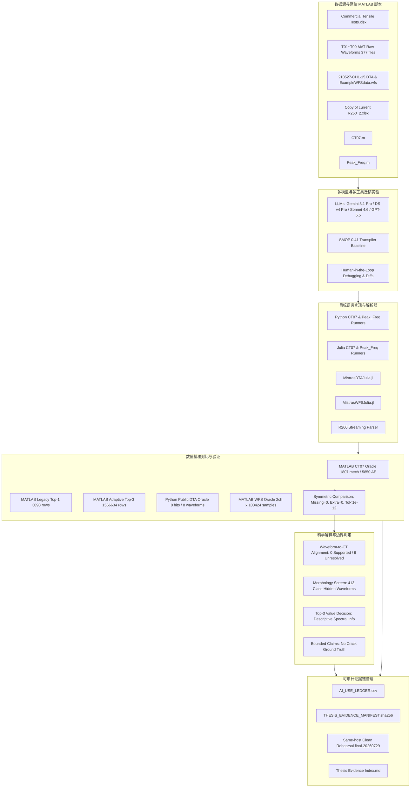

# 毕业设计项目完整结构与架构规范 (Individual Project Structure)

> **文档状态**：Canonical Structure Reference  
> **关联目录**：`Individual Project/`（只读，未做任何修改）  
> **生成时间**：2026-08-22  
> **定位说明**：本文档系统性梳理毕业设计《可审计的人机协同 MATLAB 声发射科学计算工作流迁移与多语言数值验证》的完整项目结构、模块划分、数据/代码流转拓扑以及证据链管理机制。

---

## 1. 项目全景概览 (Project Overview)

本项目针对实验力学与声发射 (Acoustic Emission, AE) 领域长期依赖专有 MATLAB 脚本与商业软件格式（如 Physical Acoustics / Mistras AEWin）的痛点，构建了一套**可审计、具备完整证据链、结合大语言模型 (LLM) 与人工在环 (Human-in-the-loop) 修复的科学代码迁移与数值验证框架**。

核心研究将 MATLAB 编写的力学及声发射分析工作流迁移至开源高性能语言生态（**Python** 与 **Julia**），并通过严格的数值基准（MATLAB/Python Oracle）、对称差异比对（Symmetric Missing/Extra Comparison）、SHA-256 完整性哈希清单以及失败-修复全量日志，对迁移成果做出具有严谨科学边界的验证。

### 核心研究对象与七大验证案例矩阵 (Seven-Case Architecture)

| 序号 | 案例模块 (Case) | 输入数据与源脚本 | 数值基准 (Oracle) | 目标语言与实现形态 | 验证规模与关键指标 | 科学解释与边界限制 |
| :--- | :--- | :--- | :--- | :--- | :--- | :--- |
| **1** | **CT07 宏观力学与 AE 汇总** | `Commercial Tensile Tests.xlsx` (Sheet CT07), `CT07.m` | MATLAB R2026a Oracle | 8 个候选派生的 Python/Julia Validation Runners | 1,807 条力学记录，5,850 条 AE 记录；8/8 通过，0 missing/extra，各生成 5 张对应曲线图 | 仅限实验汇总级验证；未与原始波形进行时间戳对齐映射 |
| **2** | **SMOP 确定性转译基线** | `CT07.m` 与同上数据表格 | MATLAB CT07 Oracle | SMOP 0.41 原始转译 + 2 种人工修复路径 | 原始转译无法运行；2 种修复路径（脚本级/运行时兼容）均 100% 匹配 Oracle | 作为 LLM 诞生前的确定性转译基线，对比人工介入与模型表现 |
| **3** | **Legacy Top-1 主频提取** | 完整 T01 批次 MAT 波形文件 | MATLAB Legacy Top-1 导出 | Python / Julia 迁移实现 | 3,098 行输出，三语言精确一致，最大幅值差 $< 5.68 \times 10^{-13}$ | 仅在完整 T01 批次上证明算法等价性；力学阶段映射未解析 |
| **4** | **Adaptive / Top-3 自适应频域扩展** | T01–T09 共 377 个 MAT 文件 | MATLAB 自适应/Top-3 对照导出 | Python / Julia 迁移实现 | 9,472,125 个完整时域窗，522,216 个触发事件，1,566,634 个 Top-3 频谱记录；三语言完全一致 | 自适应事件反映检测灵敏度与覆盖率，非真实损伤真相；Top-3 仅作描述性频谱补充；0/9 机械阶段映射支持 |
| **5** | **Mistras DTA Julia 读取器** | 公开 `210527-CH1-15.DTA` 二进制数据 | 公开 Python Fixture Oracle | Julia 原生二进制解析库 (`MistrasDTAJulia.jl`) | 8 个 Hit，8 个波形；56/56 单元与回归测试通过；对称比对 0 missing/extra | 针对该特定 DTA 变种的工作流适用性，不代表支持所有 DTA 方言或真实钢轨裂纹检测 |
| **6** | **Mistras WFS Julia 读取器** | 公开 `ExampleWFSdata.wfs` 二进制波形 | MATLAB R2026a 导出基准 | Julia 原生二进制解析库 (`MistrasWFSJulia.jl`) | 2 通道 × 103,424 采样点；完整电压矩阵完全相等；26/26 单元测试通过 | 单一公开固件格式验证，试样材料未知，属格式/工作流层面的适用性验证 |
| **7** | **R260_2 钢轨 AE 汇总数据探索** | `Copy of current R260_2.xlsx` (包含 S3 等试样) | 无原始 ADC 波形 Oracle | 流式 ZIP/XML 解析分析工具 (`analyse_r260.py`) | S3 包含 3,553 对 Hit/Marker，0 missing/extra/order mismatch；全量复验通过 | 仅限已处理 Hit 级数据探索；钢种标号、单位、原始波形与失效循环数未完全证实 |

---

## 2. 项目目录完整树形结构与模块详解 (Directory Hierarchy & Module Breakdown)

```text
Individual Project/
├── README.md                                # 项目规范总纲与当前有效结论声明（Canonical Scope & Claims）
├── Thesis Evidence Index.md                 # 论文主张与底层 SHA-256 数值证据映射索引（核心学术锚点）
├── Session Evidence Index.md                # 实验会话、模型调用与调试记录索引
├── Supervisor Meeting Progress Speech.md   # 导师汇报演讲稿（详尽陈述进展、成果与边界）
│
├── Background/                              # 背景调研、学术伦理规范与文献阅读笔记 (10 files)
│   ├── 00Introduction.md                    # 课题背景与研究动机引言
│   ├── 00Russell Group principles...md      # 罗素大学集团关于在教育中应用生成式 AI 的五大原则
│   ├── 00Why and How to Translate...md      # 科学计算代码从 MATLAB 到 Python 迁移指南
│   ├── 01Reading notes：Lost in Translation.md
│   ├── 02Reading notes：From Over-Reliance to Smart Integration.md
│   ├── 03Reading notes：Translating code with LLMs and human-in-the-loop.md
│   ├── 04Reading notes：Using artificial intelligence in academic writing...md
│   ├── 05Reading notes：ML for Discrete Acoustic Emission Interpretation.md
│   ├── 06Reading notes：Quantitative SHM of Composite Materials.md
│   └── 07Reading notes：Multi-Variant Damage Assessment in Composites Using AE.md
│
├── CT07-PeakFreq-Validation/                # 核心验证工程包：CT07 与 Peak_Freq 多语言数值验证框架
│   ├── README.md                            # 核心工程包技术说明与复现指南
│   ├── run_validation.py                    # 统一验证执行主程序入口
│   ├── validation.toml                      # 实验参数、路径映射与公差配置文件
│   ├── environment/                         # 依赖环境配置 (requirements.txt, README.md)
│   ├── manifests/                           # SHA-256 完整性清单与输入文件指纹清单
│   │   ├── code.sha256                      # 核心代码哈希
│   │   ├── inputs.sha256                    # 输入数据源文件哈希
│   │   ├── results.sha256                   # 输出结果哈希
│   │   ├── input_inventory.csv              # 输入文件盘点清单 (377 个 MAT 文件等)
│   │   └── manifest_metadata.json           # 清单元数据
│   ├── code/                                # 多语言验证与对照实现源码
│   │   ├── ct07/                            # 8 个候选派生 Python/Julia CT07 运行脚本
│   │   ├── matlab/                          # MATLAB 对照导出辅助脚本
│   │   └── peak-frequency/                  # Peak_Freq Python/Julia/MATLAB 实现源码
│   ├── results/                             # 最终数值验证输出结果与结构化评估
│   │   ├── validation_matrix.csv            # 跨案例验证汇总矩阵表
│   │   ├── validation_summary.json          # 自动化验证结果 JSON 汇总
│   │   ├── rerun_scientific.log             # 科学分析复现执行日志
│   │   ├── ct07/                            # CT07 LLM 候选与 SMOP 对比结果
│   │   │   ├── llm-validation/              # 8 组模型候选生成物、Probe 与 Runner 证据
│   │   │   └── smop/                        # SMOP 原始转译评分与修复比对结果
│   │   ├── peak-frequency/                  # Peak_Freq 数值对比数据
│   │   │   ├── legacy-t01-three-language/   # Legacy T01 三语言一致性比对结果 (3,098 行)
│   │   │   ├── adaptive-three-language/     # Adaptive/Top-3 T01-T09 全量比对结果
│   │   │   └── legacy-adaptive-framing/     # Legacy 与 Adaptive 分帧参数对照
│   │   ├── scientific/                      # 科学分析与解释报告
│   │   │   ├── Scientific Interpretation Report.md # 综合科学解释报告
│   │   │   ├── alignment_summary.json       # 9 组力学时间-波形对齐结果 (0 supported, 9 unresolved)
│   │   │   ├── top3_value_summary.json      # Top-3 决策规则与频谱增量评估
│   │   │   └── waveform_morphology_screen_method.json # 413 个波形形态筛选分类方法
│   │   └── input/                           # 输入数据元数据缓存
│   ├── rehearsals/                          # 独立干净环境复演记录 (final-20260729, r2)
│   └── scientific/                          # 科学分析与自动化测试脚本
│       ├── scientific_analysis.py           # 统计分析、波形对齐与形态学筛选算法
│       ├── test_run_validation.py           # 验证流程单元测试
│       └── test_scientific_analysis.py      # 科学分析逻辑单元测试
│
├── evidence-chain/                          # 全流程可审计证据链基础设施 (Traceability Infrastructure)
│   ├── AI_USE_LEDGER.csv                    # 全生命周期 AI 使用分类台账 (按罗素集团与学术诚信准则)
│   ├── THESIS_EVIDENCE_MANIFEST.sha256      # 论文所有数据结论的 SHA-256 根锚点
│   ├── THESIS_EVIDENCE_MANIFEST_METADATA.json # 证据链元数据
│   ├── workflow-evidence-chain.mmd          # 证据链流转 Mermaid 架构源码
│   └── workflow-evidence-chain.svg          # 证据链流转可视化矢量图
│
├── MATLAB Validation Package/               # MATLAB Legacy 验证与基准导出包
│   ├── README.md                            # 模块说明
│   ├── run_legacy_peak_freq_export.m        # MATLAB 原生 Legacy 算法导出脚本
│   └── Results/                             # 原始 MATLAB 导出与行比对结果 (CSV / JSON)
│
├── MistrasDTAJulia/                         # Mistras / AEWin DTA 二进制文件 Julia 读取器模块
│   ├── Project.toml / Manifest.toml         # Julia 标准包元数据与依赖锁定
│   ├── README.md / PROVENANCE.md            # 模块文档与数据出处追踪说明
│   ├── THIRD_PARTY_NOTICES.md               # 第三方开源协议声明
│   ├── MANIFEST.sha256                      # 模块级文件 SHA-256 清单
│   ├── src/                                 # Julia 源码 (MistrasDTAJulia.jl)
│   ├── test/                                # 56 项单元与回归测试套件 (包含 reference 数据与 runtests.jl)
│   ├── upstream/                            # 上游参考代码 (MATLAB 原型与 Python 库)
│   ├── tools/                               # Python Oracle 导出脚本与波形绘图工具
│   ├── experiments/                         # 隔离实验记录与 LLM 生成失败-修复 Diff
│   │   ├── frozen_prompt.md                 # 冻结的调用 Prompt
│   │   ├── matlab_source_candidate.jl       # MATLAB 路径生成源码（第一轮运行失败）
│   │   ├── python_source_candidate.jl       # Python 路径生成源码
│   │   ├── diffs/                           # 候选代码到最终可用 Reader 的修正 Diff
│   │   └── experiment_record.md             # 实验与评分记录
│   └── results/                             # 最终验证结果 (final_validation.md, comparison_summary.toml)
│
├── MistrasWFSJulia/                         # Mistras WFS 波形二进制文件 Julia 读取器模块
│   ├── Project.toml / MANIFEST.sha256       # Julia 包配置与文件校验清单
│   ├── README.md / PROVENANCE.md / THIRD_PARTY_NOTICES.md
│   ├── src/                                 # Julia 源码 (MistrasWFSJulia.jl)
│   ├── test/                                # 26 项单元测试套件
│   ├── upstream/                            # MATLAB 上游解析源码
│   ├── tools/                               # MATLAB Oracle 导出工具 (`export_matlab_oracle.m`)
│   └── results/                             # 最终比对与验证报告 (`comparison_summary.toml`, `final_run.log`)
│
├── R2602Analysis/                           # R260_2 钢轨 AE 汇总数据流式分析受限案例
│   ├── README.md / PROVENANCE.md            # 案例说明与严格的数据 Provenance / 局限性说明
│   ├── MANIFEST.sha256 / EXTERNAL_INPUTS.sha256 # 文件哈希清单
│   ├── tools/                               # 分析工具集
│   │   ├── analyse_r260.py                  # 基于流式 ZIP/XML 的大型 Excel 解析工具
│   │   ├── verify_r260.py                   # 自动化校验程序
│   │   ├── final_rehearsal.py               # 隔离复演执行脚本
│   │   └── plot_s3.py                       # 试样 S3 绘图工具
│   ├── results/                             # 分析结果 (analysis_report.md, s3_feature_summary.tsv 等)
│   └── evidence/                            # 复演执行日志与隔离产物
│
├── Tools history/                           # 多 Agent 工具与多模型跨平台迁移实证历史归档 (959 files)
│   ├── Antigravity Cli/                     # Google Gemini 3 Flash / Gemini 3.1 Pro (Python/Julia) 实测
│   ├── Claude code cli ccswitch to Deepseek-v4-pro/ # DeepSeek v4 Flash / Pro (Python/Julia) 实测
│   ├── Claude code Desktop Sonnet 4.6/      # Claude Sonnet 4.6 (Adaptive/Python/Julia) 实测
│   ├── Codex Cli/                           # GPT-5.3 / GPT-5.5 (Python/Julia) 实测
│   └── SMOP/                                # SMOP 确定性代码转译器实测记录
│
├── Notes/                                   # 研发全过程演进笔记与阶段性备忘录 (17 篇 Markdown)
│   ├── 00SMOP & Cookiecutter Install.md     # 工具环境搭建
│   ├── 01~03 Prompt_Methodology & Comparison Experiments.md # 提示词工程演变实验 1~3
│   ├── 10Comparison_Experiment_2&3.md       # 提示词实验横向对比
│   ├── 11Developing New Algorithms for AE Analysis.md # 新算法构思与数学推导
│   ├── 12~14 AE Peak-Frequency Implementation & Prototype Plans.md # 主频算法演进方案
│   ├── 15 T02-T04 / T01-T09 Legacy vs Adaptive Comparison.md # 算法比对实验
│   ├── 16 Project Status Review.md          # 阶段状态评审
│   ├── 17 Mistras DTA-WFS Steel Applicability Research.md # 钢材声发射格式研究
│   ├── 18 Final Validation Milestone Summary.md # 最终验证里程碑封板总结
│   └── 99 AE Peak-Frequency Development Log.md # 开发流水日志
│
├── Diary/                                   # 研发进展周记
│   ├── 2026.05.20 ~2026.05.27.md
│   └── 2026.05.27~ 2026.06.04.md
│
├── Presentation/                            # 答辩与汇报素材
│   └── AE_Project_Progress_Review.pptx      # 导师进度评审演示文稿
│
└── temp/                                    # 过程暂存、历史运行产物与中间调试仓库 (只读保留)
```

---

## 3. 技术与数据流转拓扑 (Workflow & Evidence Topology)



---

## 4. 证据链管理与可审计机制 (Evidence Lineage & Auditability)

项目设计了四层严密的可审计保障体系：

1. **AI 使用全量台账 (`AI_USE_LEDGER.csv`)**：
   - 遵循罗素大学集团 (Russell Group) 规范，清晰区分 `model_generation`、`agent_assisted_debugging`、`researcher_decision` 与 `automated_verification` 四类活动。
   - 完整记录模型名称、推理强度（High / XHigh）、调用接口、Prompt 哈希、原始回复哈希、输出产物哈希与人工决策依据。
2. **候选生成物三级证据隔离 (`Candidate Three-Level Separation`)**：
   - 第一级：`original_generation`（模型初次生成的原始代码）；
   - 第二级：`fixture_normalized_probe`（适配统一输入输出探针后的探针代码）；
   - 第三级：`candidate_derived_validation_runner`（经过人工修复、用于通过数值校验的最终运行器）。
   - 绝不将人工修复后的运行器伪装成“模型一次性零样本生成成功”，诚实记录修复 Diff。
3. **全局 SHA-256 指纹锚点 (`THESIS_EVIDENCE_MANIFEST.sha256`)**：
   - 锁定从外部输入文件、源代码、测试日志到最终结果 JSON/CSV 图表的所有二进制哈希，确保论文中引用的每一个数值均有不可篡改的底层证据对应。
4. **独立干净环境演练 (`Clean-Environment Rehearsal`)**：
   - 记录完整 61 条重演指令，验证在干净隔离环境中能够从头复现所有数值表格与 413 幅形态学图表，确保实验过程经得起第三方独立复查。

---

## 5. 项目客观评价 (Objective Project Evaluation)

### 5.1 学术与工程亮点 (Outstanding Merits)

1. **科研诚信与方法学严谨性极高（Exemplary Scientific Rigour & Integrity）**：
   - 许多涉及 AI 代码生成的论文容易陷入“选择性汇报”或“将人工调优结果包装为模型一次性生成”的误区。本项目明确建立“三级证据隔离机制”，诚实保留并记录了如 `MATLAB-source DTA candidate` 编译后读取抛出 `MethodError`、`Python-source DTA candidate` 误判 7 类报文等失败案例，客观记录修复 Diff。
   - 对实验结论的边界控制极为克制：当 9 组声发射波形与力学拉伸时间的映射缺乏绝对时间戳证据时，明确判定为 `0 supported, 9 unresolved`，坚决不作过度外推或虚假的力学阶段/裂纹阶段归因。
2. **工业级数值比对与验证框架（Robust Numerical Verification Protocol）**：
   - 采用了严格的**对称比对（Symmetric Missing/Extra Comparison）**，而非简单的相关系数比对；
   - 验证规模庞大且扎实：CT07 完成 8 个模型派生运行器的全量比对；Legacy 算法完成 3,098 行输出对比；Adaptive/Top-3 算法在 377 个文件、947 万个时域窗口、52.2 万个触发事件及 156.6 万行 Top-3 频谱记录上实现了三语言（MATLAB/Python/Julia）误差低于 $10^{-12}$ 的完全一致。
3. **跨语言生态构建与技术深度（High Technical & Engineering Competence）**：
   - 不仅完成了从 MATLAB 到主流 Python 的迁移，更开创性地在 **Julia** 生态中独立实现了高性能声发射二进制格式（Physical Acoustics / Mistras DTA 和 WFS）的流式读取器与解析包（`MistrasDTAJulia.jl`, `MistrasWFSJulia.jl`），填补了 Julia 生态在声发射工业二进制解析领域的空白。
   - 针对大型 Excel 文件，实现了基于流式 ZIP/XML 的内存高效解析（`R2602Analysis`），展现了优秀的底层工程架构能力。
4. **多模型、多工具横向实证的广度（Broad Empirical Evaluation Spectrum）**：
   - 涵盖了 Gemini 3.1 Pro、DeepSeek v4 Pro、Claude Sonnet 4.6、GPT-5.5 等当代顶尖的大语言模型，同时引入了经典转译器基准 SMOP 0.41，形成了现代生成式 AI 与传统规则转译器的完整对比维度。

### 5.2 论文整合与后续建议 (Recommendations for Thesis Submission)

1. **论文正文中的主次篇幅分配**：
   - 核心篇幅应聚焦于 **CT07 与 Peak_Freq 的跨语言迁移方法学、数值验证框架及 Human-in-the-Loop 错误分类学（Taxonomy of Translation Errors）**；
   - DTA、WFS 与 R260_2 应严格按照 `Bounded Steel-Related Cases`（受限钢材相关工作流适用性案例）进行论述，强调其作为“工作流/格式层面的技术可行性验证”，继续严格保留不作材料裂纹分类准确率断言的克制表述。
2. **环境路径配置的便携化说明**：
   - 现有的 `validation.toml` 与 SHA 清单中部分外部输入指向绝对路径（如 `/Users/vangogh/...`），在论文的方法论章节中可说明已通过 `Same-host Rehearsal` 进行了封闭验证；若未来开源发布，可提供相对路径环境变量引导脚本以方便跨机器一键安装复现。
3. **答辩防御要点（Defensible Claims Strategy）**：
   - 答辩过程中若评委提问“是否实现了钢轨真实裂纹识别”，应依据项目预设的规范防御口径回答：“本项目核心贡献在于建立了可审计、高保真的科学计算代码开源迁移与数值验证标准体系；钢轨数据案例证明了该体系对工业二进制格式的解析与工作流适应性，不包含未经验证的损伤阶段分类断言。”——这种清晰严谨的边界意识将在答辩中成为极大的学术加分项。
